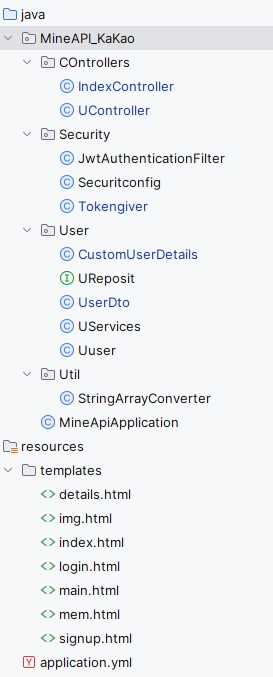
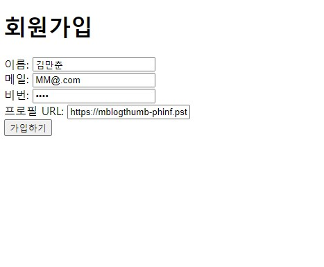
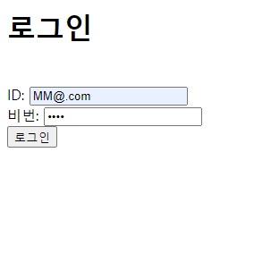
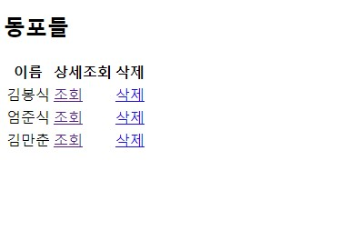

### 스프링부트를 활용한 로그인 구현(10/20 ~ 11/20)

---
__○ 프로젝트 구조__

  

__☆사용된 프로그램__
- InteliJ -- Java11
- H2 database

H2데이터 베이스에 데이터를 추가하고 불러오는 기능이 구현된 프로젝트입니다. 스프링 시큐리티와 RestFul API를 구현하려 했으나 잘 안됬습니다.
아무튼 회원가입과 로그인이 되긴합니다.

#### 구현 화면
---

  

 1. 초기화면
 

  

2. 일반 회원가입

 

  

3. 회원가입 성공

 

  

4. 로그인 화면

 

  

5. 메인 화면

 

  

6. 유저 정보 조회 및 삭제

 

  

### __※ 하자가 있는 사항__

- 로그인시 헤더에 토큰을 첨가하는 기능이 구현되지 않았습니다.
  HTML 파일에 직접 첨부해줘야 합니다ㅋ('Authorization': '~~')
