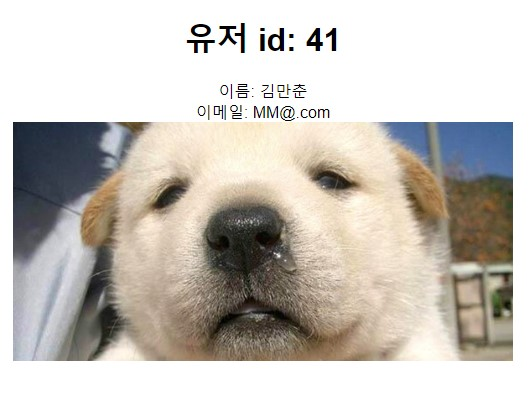

### 스프링부트를 활용한 로그인 구현(10/20 ~ 11/20)

#### __※ 개발환경__

- IDE : InteliJ IDEA Community
- Spring Boot 2.7.6
- JDK 11
- H2 DataBase
- Spring Data JPA
- Thymleaf
- Spring Security

---
__○ 프로젝트 구조__

  

#### 주요기능(CRUD)
- 1. 회원가입
- 2. 로그인
  - 일반 로그인
  - 카카오톡 로그인
- 3. 로그아웃
- 4. 사용자 조회

#### ☆ 수정 처리
- 사용자 데이터 DB에 저장(회원가입)
- 사용자 데이터 삭제(회원 탈퇴, 로그아웃: 토큰 삭제)
- 사용자 토큰 발급

#### 구현 화면
---

  

 1. 초기화면
 

  

2. 일반 회원가입

 

  

3. 회원가입 성공

 

  

4. 로그인 화면

 

  

5. 메인 화면

 

  

6. 유저 정보 조회 및 삭제

 

  

### __※ 하자가 있는 사항__

- 로그인시 헤더에 토큰을 첨가하는 기능이 구현되지 않았습니다.
  헤더에 토큰을 첨부하는 클라이언트 로직으로 인증인가를 구현하는데 실패했습니다.

  ### __♧ 향후 업데이트 사항__

- 요청시 헤더에 토큰을 첨부하는 기능( 토큰 인증인가 구현 )
- 게시글 업로드 기능

__버전 정보__

- 1.0.00 : 최초 CRUD기능 구현
- 1.0.10 : DB연동 기능 구현
- 1.0.15 : 카카오톡 로그인 기능 추가
- 1.0.20 : 사용자 조회및 삭제기능 구현
- 1.0.25 : 토큰 DB저장 기능

---
### 앞으로의 개선 사항
 

- __실패하든 성공하든 개발 일지 작성의 필요성__

  : 1달넘게 실패했는데 그간의 노력의 증거가 없다. 이때동안 뭐했나 싶다. 실패한 결과물도 결과물이다. 모든 작업과 노력은 기록되어야 한다.

- __편협적 접근방식__

 : 지식이 부족한 상태에서  널려있는 자료를 이거 조금 저거조금 이어 붙히느라 프랑켄슈타인같은 결과물이 나와버렸다. REST API의 독립성적인 속성을 이상하게 이해한듯한 작업 방식이었다. 심지어 이거 REST API도 아니다. 전체적인 프로젝트의 목표와 목적을 볼 수 있어야하고 계획을 수립해서 개발의 방향성을 가지고 시작하는게 중요하다는 깨달음을 얻었다.
