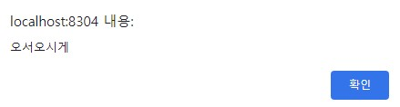

### 스프링부트를 활용한 로그인 구현(10/20 ~ 11/20)

#### __※ 개발환경__

- IDE : InteliJ IDEA Community
- Spring Boot 2.7.6
- JDK 11
- H2 DataBase
- Spring Data JPA
- Thymleaf
- Spring Security

---
__○ 프로젝트 구조__

  

#### 주요기능(CRUD)
- 1. 회원가입
- 2. 로그인
  - 일반 로그인
  - 카카오톡 로그인
- 3. 로그아웃
- 4. 사용자 조회

#### ☆ 수정 처리
- 사용자 데이터 DB에 저장(회원가입)
- 사용자 데이터 삭제(회원 탈퇴, 로그아웃: 토큰 삭제)
- 사용자 토큰 인증인가

#### 구현 화면
---

  

 1. 초기화면
 

  

2. 일반 회원가입

 

  

3. 회원가입 성공

 

  

4. 로그인 화면

 

  

5. 메인 화면

 

  

6. 유저 정보 조회 및 삭제

 

  

### __※ 하자가 있는 사항__

- 로그인시 헤더에 토큰을 첨가하는 기능이 구현되지 않았습니다.
  HTML 파일에 직접 첨부해줘야 합니다ㅋ('Authorization': '~~')

  ### __♧ 향후 업데이트 사항__

- 요청시 헤더에 토큰을 첨부하는 기능( 토큰 인증인가 구현 )
- 게시글 업로드 기능
- 실시간 채팅 기능

__버전 정보__

- 1.0.00 : 최초 CRUD기능 구현
- 1.0.10 : DB연동 기능 구현
- 1.0.15 : 카카오톡 로그인 기능 추가
- 1.0.20 : 사용자 조회및 삭제기능 구현
- 1.0.25 : 토큰 DB저장 기능
